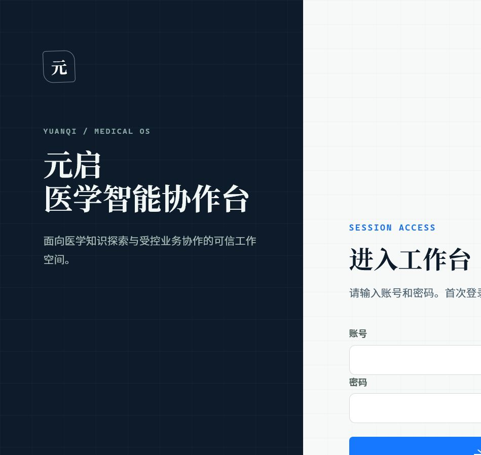

# YuanQi Agent（元启医学智能协作台）

元启是一个用于**医学知识探索**和**受权限保护的临床业务协作**的本地演示项目。它由 React 前端、Spring Boot 后端、FastAPI/LangGraph Agent 和 Neo4j 医学知识图谱组成。

> 本项目用于技术演示和医学知识检索，不提供诊断、处方或治疗结论。生产使用前必须接入真实身份认证、密钥管理、数据治理与合规审查。

## 项目预览



## 下载项目后能得到什么？

- 可以创建一套**全新的本地** MySQL、Redis、Neo4j 和 Qdrant 服务；不会下载或连接作者的数据库。
- 后端会用 Flyway 自动创建业务表、权限表和少量**无真实患者信息**的演示账号。
- 可以运行患者、病历、处方、审批、审计、检查报告解读和医学知识图谱界面。
- 不包含真实患者资料、运行日志、JWT、`.env`、数据库 volume 或 Agent 会话检查点。
- 包含用于图谱演示的医学目录 `agent/data/medical.json`。该目录来自第三方开源项目，按 Apache-2.0 许可随仓库分发；来源、使用边界与导入方式见 [`agent/data/SOURCE.md`](agent/data/SOURCE.md)。它不含患者或诊疗业务数据。

## 项目结构

| 目录 | 作用 |
| --- | --- |
| `frontend/` | React 18 + TypeScript 前端；默认运行在 `http://localhost:5173`。 |
| `backend/` | Spring Boot 3 / JDK 17 后端；负责登录、JWT、行级权限、业务数据与 Agent 网关。 |
| `agent/` | FastAPI + LangGraph Agent；负责知识检索、流式回答、审批中断和恢复。 |
| `docs/` | 数据治理、可信医学回答和安全测试说明。 |
| `compose.yaml` | 本地 MySQL、Redis、Neo4j、Qdrant 容器定义。 |
| `scripts/` | 一键校验、冒烟测试和验收数据清理脚本。 |

## 架构与数据边界

```text
浏览器（React）
    │  登录、JWT、SSE
    ▼
Java 后端（Spring Boot）
    │  鉴权后在内网转发当前 JWT
    ▼
Agent（FastAPI / LangGraph）
    ├── Neo4j：医学知识图谱
    ├── Qdrant：可选的向量检索
    └── Docker 沙箱：受限的数据分析

MySQL：患者、病历、处方、审批、审计等业务数据，只允许 Java 访问。
Redis：写请求幂等缓存。
```

Agent 和模型不直接访问 MySQL；涉及业务写入的 Agent 操作会先暂停，等待当前登录用户确认后再执行。

## 快速启动（Windows / PowerShell）

### 1. 准备环境

需要安装：

- JDK 17、Maven 3.9+
- Python 3.12
- Node.js 20.19+ 或 22.12+
- Docker Desktop

克隆仓库后，在项目根目录复制本地环境模板：

```powershell
Copy-Item .env.example .env
```

`.env` 只用于本机 Docker 与后端连接配置，**不要提交到 GitHub**。首次本地使用可保留模板中的默认值；部署或共享环境必须替换密码和 JWT 密钥。

### 2. 启动基础服务

```powershell
docker compose up -d mysql redis neo4j
```

如需启用向量检索（GraphRAG），再启动 Qdrant：

```powershell
docker compose up -d qdrant
```

如需使用“处方分析”功能，还需要构建隔离执行镜像：

```powershell
docker build -f agent/sandbox/Dockerfile -t yuanqi-agent-sandbox:local agent/sandbox
```

### 3. 启动后端

新开一个 PowerShell：

```powershell
Set-Location backend
mvn spring-boot:run "-Dspring-boot.run.profiles=dev"
```

后端地址为 `http://localhost:8080`，接口文档为 `http://localhost:8080/swagger-ui.html`。

### 4. 启动 Agent

再开一个 PowerShell：

```powershell
Set-Location agent
Copy-Item .env.example .env
py -3.12 -m venv .venv
.\.venv\Scripts\python -m pip install -e ".[dev]"
.\.venv\Scripts\yuanqi-agent
```

Agent 默认监听 `http://localhost:8000`。浏览器不会直接访问它，而是由 Java 后端在鉴权后转发请求。

本地可选配置 Ollama 以生成自然语言回答：

```powershell
$env:YUANQI_PLANNER_OLLAMA_URL = "http://localhost:11434/api/chat"
$env:YUANQI_PLANNER_OLLAMA_MODEL = "qwen3:8b"
```

未配置模型时，结构化工具调用、知识图谱接口和自动测试仍可使用；自然语言生成能力会受限。

### 5. 启动前端

再开一个 PowerShell：

```powershell
Set-Location frontend
Copy-Item .env.example .env
npm install
npm run dev
```

打开 `http://localhost:5173`。开发服务器会将 `/api/v1/*` 自动转发到 Java 后端。

本地演示账号：`yu_ming_demo`，初始密码：`123456`。首次登录后必须修改为包含大小写字母、数字和符号、且至少 10 位的新密码。

## 导入医学知识图谱（可选）

仓库已随附一份用于图谱演示的医学目录 `agent/data/medical.json`。它来自第三方开源数据集，仅用于学习、检索和界面演示，不能作为诊断、治疗或处方依据；完整来源与许可见 [`agent/data/SOURCE.md`](agent/data/SOURCE.md)。如需替换为其他数据源，请先确认其再发布许可且不含个人信息，再执行：

```powershell
Set-Location agent
.\.venv\Scripts\python scripts/import_disease_kb.py --file data/medical.json
.\.venv\Scripts\python scripts/standardize_medical_catalog.py
.\.venv\Scripts\python scripts/publish_trusted_medical_subset.py
```

也可以运行 `agent/scripts/run_medical_pipeline.ps1`。若设置 `YUANQI_GRAPHRAG_ENABLED=true`，还需启动 Qdrant 并运行索引步骤。数据分层、来源要求和发布规范见 [可信医学问答说明](docs/TRUSTED_MEDICAL_QA.md)。

## 常用命令

```powershell
# 校验 Docker 配置、后端测试、Agent 测试、前端测试和前端构建
.\scripts\verify.ps1

# 同时构建并验证 Docker 沙箱
.\scripts\verify.ps1 -WithDockerSandbox

# 三端都启动后执行本地 HTTP 冒烟测试（只使用开发数据）
.\scripts\live-smoke.ps1
```

## 发布到 GitHub 前

本仓库只包含源码、配置模板和数据库初始化脚本；不会上传本机数据库或真实业务数据。下载者执行 Docker Compose 并启动后端后，系统会在其自己的电脑上创建一套新的本地数据库。

- `db/migration/` 中的 SQL 用于创建和升级表结构，不包含患者、病历、处方或账号等真实数据。
- `.env`、本地会话状态、日志、依赖目录、构建产物和 Docker 数据卷都已排除，不会被 Git 提交。
- 发布前请再次确认没有提交患者信息、检查报告、密码、JWT、API Key 或数据库导出文件。

安全要求和敏感数据处理规则见 [SECURITY.md](SECURITY.md)。

## 更多说明

- [后端说明](backend/README.md)
- [Agent 说明](agent/README.md)
- [前端说明](frontend/README.md)
- [可信医学问答与知识发布](docs/TRUSTED_MEDICAL_QA.md)
- [安全测试矩阵](docs/SECURITY_TEST_MATRIX.md)
